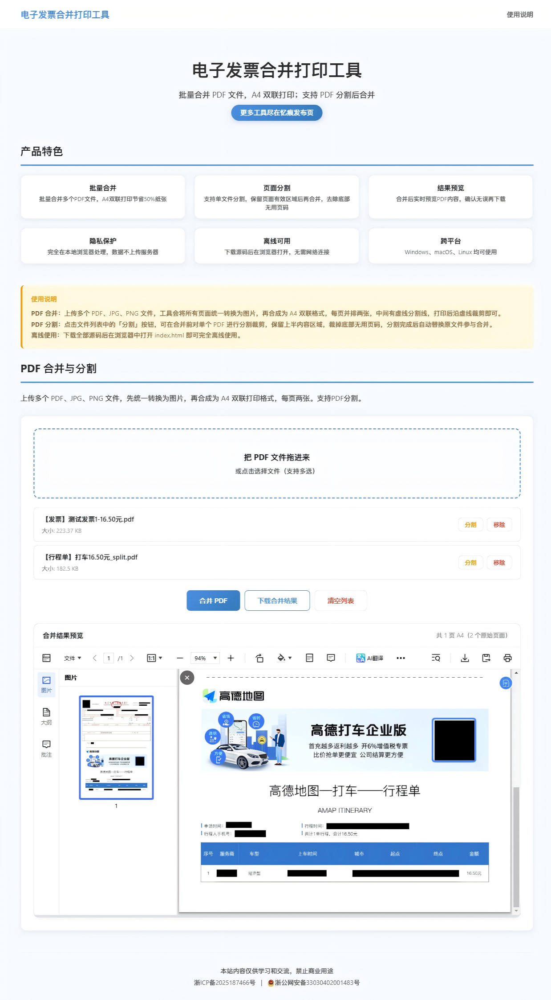

# 电子发票合并打印工具

**电子发票合并打印工具**是一款浏览器端 PDF 处理工具，支持批量合并多页 PDF 和图片文件为 A4 双联排版，以及 PDF 页面分割裁剪。所有处理均在浏览器本地完成，无需安装任何软件，文件不会上传到服务器。

## 使用场景

- **电子发票报销** -- 批量合并多张电子发票为 A4 双联排版，节约打印纸张，方便财务粘贴报销
- **合同文档整理** -- 将多份合同、协议等 PDF 合并为一个文件，方便归档和打印
- **试卷资料编排** -- 将散页试卷、习题、讲义按双页排版合并，减少纸张使用量
- **图片转 PDF** -- 将扫描件、截图、照片等 JPG/PNG 图片合并生成 PDF 文档
- **PDF 页面裁切** -- 合并前对单个 PDF 进行分割裁剪，保留有效内容区域，裁掉底部无用页码
- **证件扫描整理** -- 将身份证、营业执照等扫描件合并排版后打印
- **手册说明书合并** -- 将多份产品手册、说明书合并为一份完整的 PDF 文档

## 功能特色

### PDF 合并
- **多文件上传** -- 支持拖拽上传 PDF、JPG、PNG 文件，可多选或批量拖入
- **统一转图片** -- 所有页面先统一渲染为图片，再合成为 PDF，避免字体和格式兼容问题
- **中文 CID 字体支持** -- 内置 CMap 字符映射表，完美渲染 STSong-Light 等中文字体
- **A4 双联排版** -- 自动将每两页合并到一张 A4 纸上，节约 50% 纸张
- **多页展开** -- 自动将多页 PDF 逐页展开，再按两页一组配对排版
- **实时预览** -- 合并后即时生成 PDF 预览，支持旋转查看
- **一键下载** -- 生成标准 PDF 文件，直接下载打印

### PDF 分割（集成于合并列表中）
- **文件级分割** -- 点击 PDF 文件的「分割」按钮，弹窗中拖动滑块实时调整裁剪比例
- **实时预览** -- 红线标注裁剪位置，下半部分半透明遮罩，所见即所得
- **自动替换** -- 分割完成后自动替换原文件，文件名追加 _split 标识
- **多页支持** -- 自动处理 PDF 的所有页面，每页按相同比例裁剪

### 技术特点
- **完全离线** -- 所有处理在浏览器本地完成，保护数据隐私
- **零安装** -- 打开浏览器即可使用，无需额外软件
- **拖拽上传** -- 支持拖拽文件到上传区域，操作高效

## 使用说明

### 合并 PDF

1. 拖拽或点击上传 PDF / JPG / PNG 文件
2. 如需分割某个 PDF，点击文件右侧的「分割」按钮
3. 在弹窗中调整保留比例，预览确认后点击「确认分割」
4. 分割完成后自动替换原文件
5. 点击「合并 PDF」
6. 预览合并效果，确认后点击「下载合并结果」

## 技术栈

- [PDF.js](https://mozilla.github.io/pdf.js/) -- PDF 渲染引擎
- [pdf-lib](https://github.com/Hopding/pdf-lib) -- PDF 生成与操作
- [JSZip](https://stuk.github.io/jszip/) -- ZIP 打包
- 纯前端实现，无后端依赖

## 浏览器兼容性

- Chrome 90+
- Firefox 90+
- Edge 90+
- Safari 15+

## 测试截图

