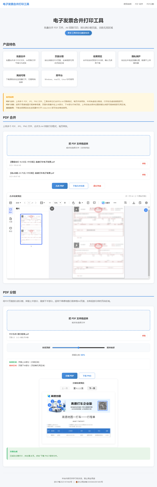

# 电子发票合并打印工具

**电子发票合并打印工具**是一款浏览器端 PDF 处理工具，支持批量合并多页 PDF 和图片文件为 A4 双联排版，以及按比例分割 PDF 页面并导出为 PNG 图片。所有处理均在浏览器本地完成，无需安装任何软件，文件不会上传到服务器。

演示地址：https://fphb.937788.xyz/

## 使用场景

- **电子发票报销** -- 批量合并多张电子发票为 A4 双联排版，节约打印纸张，方便财务粘贴报销
- **合同文档整理** -- 将多份合同、协议等 PDF 合并为一个文件，方便归档和打印
- **试卷资料编排** -- 将散页试卷、习题、讲义按双页排版合并，减少纸张使用量
- **图片转 PDF** -- 将扫描件、截图、照片等 JPG/PNG 图片合并生成 PDF 文档
- **PDF 页面裁切** -- 去除 PDF 页面中无用的页眉、页脚、广告区域，导出为干净的 PNG 图片
- **证件扫描整理** -- 将身份证、营业执照等扫描件合并排版后打印
- **手册说明书合并** -- 将多份产品手册、说明书合并为一份完整的 PDF 文档

## 功能特色

### PDF 合并
- **多文件上传** -- 支持拖拽上传 PDF、JPG、PNG 文件，可多选或批量拖入
- **A4 双联排版** -- 自动将每两页合并到一张 A4 纸上，节约 50% 纸张
- **多页展开** -- 自动将多页 PDF 逐页展开，再按两页一组配对排版
- **实时预览** -- 合并后即时生成 PDF 预览，支持旋转查看
- **一键下载** -- 生成标准 PDF 文件，直接下载打印

### PDF 分割
- **比例滑块** -- 拖动滑块实时调整分割比例（1%~99%），保留页面上半部分
- **多页处理** -- 自动处理 PDF 的所有页面
- **多页预览** -- 逐页查看分割结果，上一页/下一页翻看
- **智能下载** -- 单页直接下载 PNG，多页自动打包为 ZIP

### 技术特点
- **完全离线** -- 所有处理在浏览器本地完成，保护数据隐私
- **零安装** -- 打开浏览器即可使用，无需额外软件
- **拖拽上传** -- 支持拖拽文件到上传区域，操作高效

## 使用说明

### 合并 PDF

1. 切换到「PDF 合并」标签页
2. 拖拽或点击上传 PDF / JPG / PNG 文件
3. 调整文件顺序（如有需要）
4. 点击「合并并生成 PDF」
5. 预览合并效果，确认后点击「下载合并后的 PDF」

### 分割 PDF

1. 切换到「PDF 分割」标签页
2. 上传 PDF 文件
3. 拖动滑块调整分割比例
4. 点击「分割 PDF」
5. 预览分割结果（多页可翻页查看）
6. 点击「下载 PNG」保存文件

### 本地运行

```bash
# 下载项目后，直接用浏览器打开
open index.html

# 或启动本地服务器
python3 -m http.server 8000
```

## 技术栈

- [PDF.js](https://mozilla.github.io/pdf.js/) -- PDF 渲染引擎
- [pdf-lib](https://github.com/Hopding/pdf-lib) -- PDF 生成与操作
- [JSZip](https://stuk.github.io/jszip/) -- ZIP 打包
- 纯前端实现，无后端依赖

## 浏览器兼容性

- Chrome 90+
- Firefox 90+
- Edge 90+
- Safari 15+

## 测试截图

]
